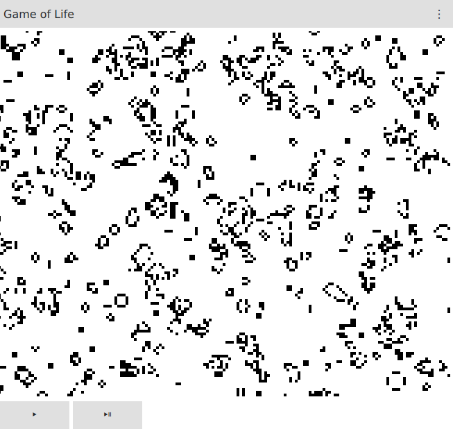
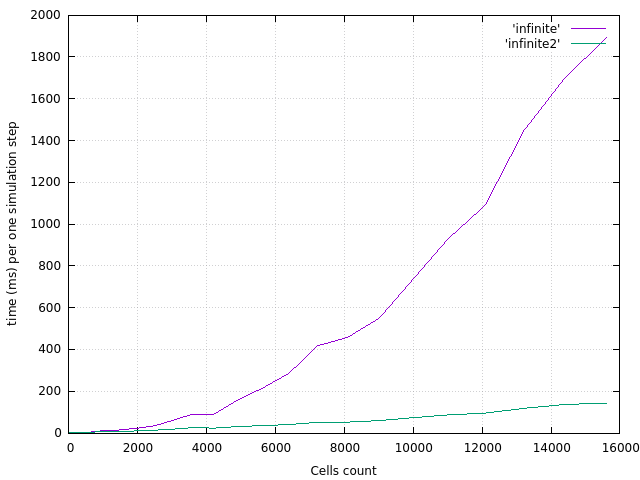
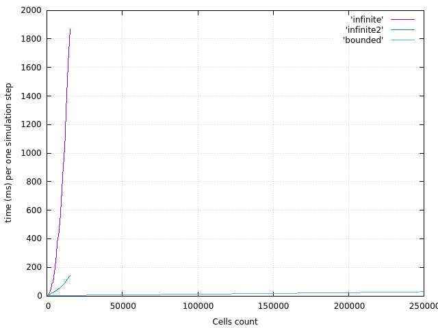

# What is this

Just another implementation of well-known zero player game called [Game of Life](https://en.wikipedia.org/wiki/Conway%27s_Game_of_Life)

# Benchmarks of implementations

 - Infinite - [functional approach](https://en.wikipedia.org/wiki/Functional_programming) with unlimited game field size build upon `std::set` (elegant, yet not very efficient)
 - Infinite2 - another functional approach build upon `std::unordered_set`
 - Bounded - naive implementation. Very fast but with bounded game field

